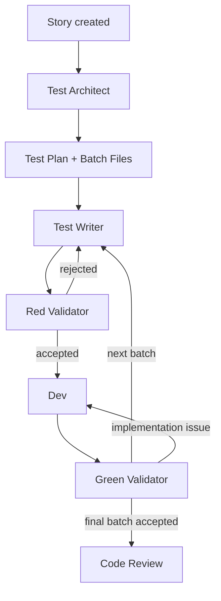
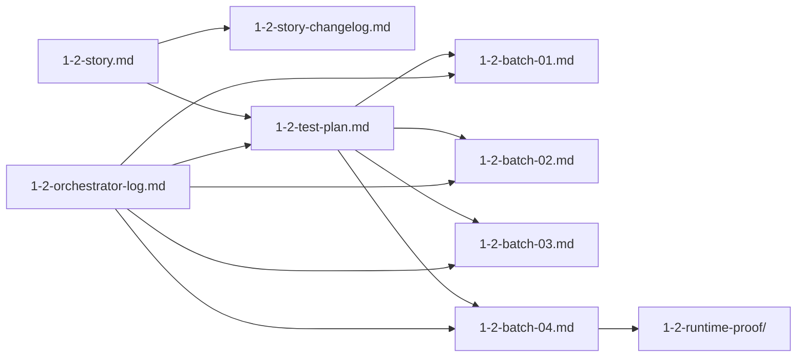
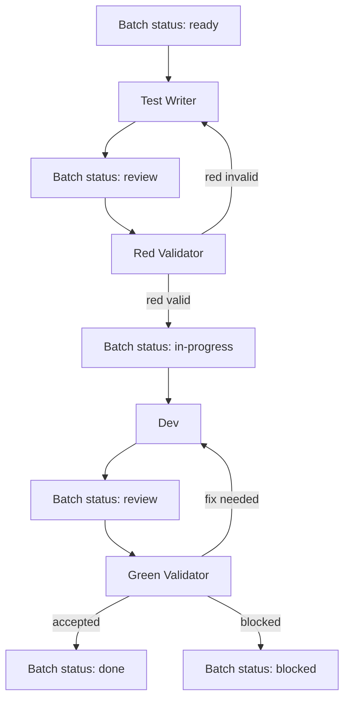

# Agentic TDD Story Workflow — Example Walkthrough

**Date:** 2026-04-13  
**Status:** Illustrative example for V1

---

## 1. Example story

Fictive story: **Story 1.2 — Add valid todo and reject empty todo**

High-level acceptance criteria:
- valid todo is added,
- counter updates,
- input clears after valid submit,
- empty todo is rejected,
- no regression of existing todo behavior.

---

## 2. Target artifact folder

```text
1-2/
  1-2-story.md
  1-2-story-changelog.md
  1-2-test-plan.md
  1-2-orchestrator-log.md
  1-2-batches/
    1-2-batch-01.md
    1-2-batch-02.md
    1-2-batch-03.md
    1-2-batch-04.md
  1-2-runtime-proof/
```

---

## 3. Example batching proposed by test-architect

### Batch 01
Goal:
- valid todo appears in list

### Batch 02
Goal:
- active counter updates

### Batch 03
Goal:
- input clears after valid submit

### Batch 04
Goal:
- empty todo is rejected

Optional final runtime validation can be tracked outside the batch list if needed.

---

## 4. Example phase-by-phase execution

### Phase 1 — Story creation
Output:
- `1-2-story.md`
- `1-2-story-changelog.md`

Git:
- **1 commit**

### Phase 2 — Test architecture
Actor:
- test-architect

Output:
- `1-2-test-plan.md`
- `1-2-batch-01.md`
- `1-2-batch-02.md`
- `1-2-batch-03.md`
- `1-2-batch-04.md`

Git:
- **1 commit**

### Phase 3 — Batch 01 test authoring
Actor:
- test-writer

Output:
- enrich `1-2-batch-01.md`
- write or update tests in codebase

Git:
- **1 commit**

### Phase 4 — Batch 01 red validation
Actor:
- red-validator

Output:
- findings appended to `1-2-batch-01.md`
- orchestrator syncs statuses in:
  - `1-2-batch-01.md`
  - `1-2-test-plan.md`
  - `1-2-orchestrator-log.md`

Git:
- **1 commit**

### Phase 5 — Batch 01 green implementation
Actor:
- dev

Output:
- code changes
- dev notes in `1-2-batch-01.md`
- standard story updates in `1-2-story.md`

Git:
- **1 commit**

### Phase 6 — Batch 01 green validation
Actor:
- green-validator

Output:
- findings in `1-2-batch-01.md`
- orchestrator syncs statuses and route decision

Git:
- **1 commit**

### Phase 7 — Repeat for Batch 02, 03, 04
Same pattern:
- test-writer
- red-validator
- dev
- green-validator
- orchestrator sync

Git:
- **1 commit per phase**

### Phase 8 — Final review
Actor:
- code review workflow

Output:
- review findings written to `1-2-story.md`
- story status updated
- story changelog may receive a summary entry

Git:
- **1 commit**

---

## 5. Example responsibilities during Batch 03

### `1-2-batch-03.md`

#### Test Writer fills
- batch goal
- precise tests authored
- expected red condition
- commands to run

#### Red Validator fills
- whether tests fail for the right reason
- whether batch is well scoped
- whether handoff to dev is allowed

#### Dev fills
- what was implemented
- changed files
- implementation notes

#### Green Validator fills
- whether behavior is truly achieved
- whether regressions are observed
- whether the batch is accepted

#### Orchestrator updates
- current batch status
- summary status in `1-2-test-plan.md`
- routing decision in `1-2-orchestrator-log.md`

---

## 6. Mermaid — high-level workflow



---

## 7. Mermaid — artifact relationships



---

## 8. Mermaid — batch-level loop



---

## 9. Why this example matters

This example shows a V1 workflow that is:
- incremental,
- auditable,
- story-compatible with BMAD,
- batch-driven,
- conservative in scope,
- and easy to run manually before automation.
